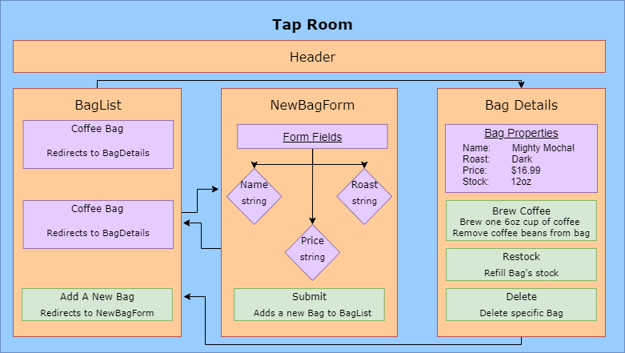

# _Tap Room_

#### _Epicodus Project Jul 3, 2020_

#### By _**Jason Macie**_

## Description

_This is a react application that implements CRUD functionality. Users should be able to Create, Read, Update, and Delete bags of coffee._

## Setup/Installation Requirements

1. Clone this repository.
2. Open terminal into the root directory of this project and run: `npm start`
3. A new tab should open in your browser.

## Known Bugs

There are no known bugs at the time of this update.

## Technologies Used

* React
* Javascript
* Node Package Manager

## Specs

1. Allow users to view a list of coffee bags.
2. Users can add new bags to the list with their desired properties: name, roast level, price
3. If a bag is clicked, it will redirect to a page detailing the specifics of that bag.
4. Detail page has a button to remove that bag from the list permenently.
5. Detail page has a button to brew a cup of coffee using that bag of coffee. The bag's stock of coffee should decrease, but not go below 0.
6. Detail page has a button to restock the bag back to it's capacity.

### License

This software is licensed under the MIT license.

Copyright (c) 2020 **_Jason Macie_**